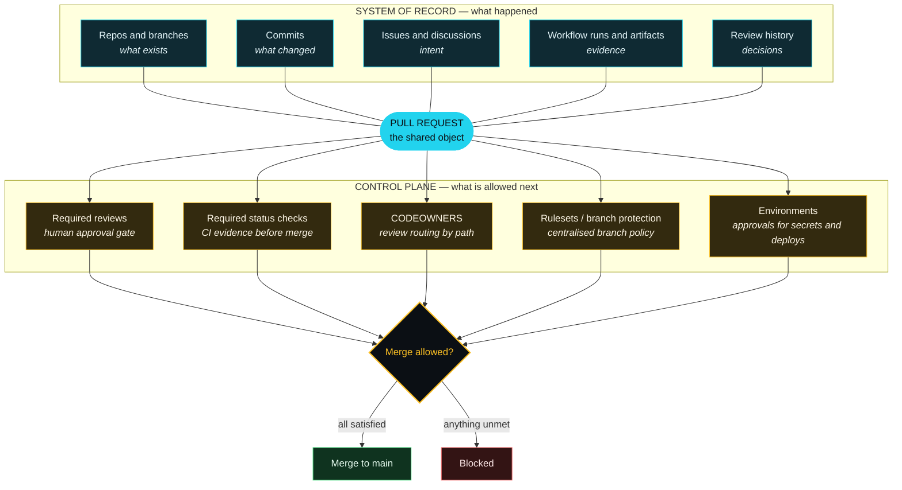

# D3 — System of Record vs Control Plane

**Used in:** Part 2, section 3. Full-bleed slide, revealed in two passes — record layer first, then
control layer drops in on click.

**Point it must make:** the same pull request sits in both layers. One layer remembers, the other
layer enforces. An agent does not need a parallel governance system.

## Narration anchor

> "Everything on the top half is memory. Everything on the bottom half is a gate. And the pull
> request is the one object that lives in both — which is why the agent does not need a governance
> system of its own. It walks into yours."

## Build notes

- Record layer in cyan `#22D3EE`, control layer in amber `#FBBF24`. Amber is reserved for enforcement
  throughout the series, so the colour itself carries meaning by Part 3.
- On the slide, the "Blocked" branch should animate in last. That is the beat where the audience
  realises the guardrail is real.
- If the diagram is too wide at 1920x1080, drop `R1` and render the record layer as four nodes. The
  branch/repo node is the least load-bearing.
