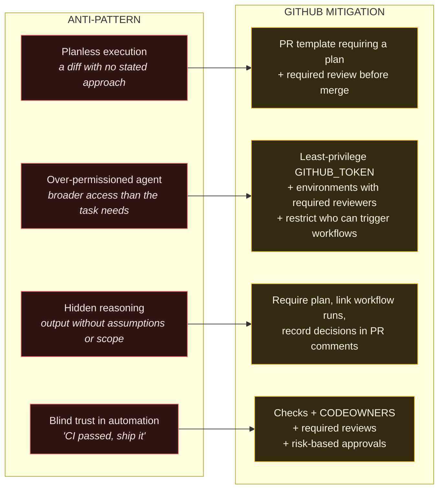

# D4 — Risk → GitHub Mitigation Map

**Used in:** Part 3, section 5. Revealed one row at a time — anti-pattern appears in red, the
mitigation lands in amber on the next click.

**Point it must make:** none of these four failures needs a new tool. Each one already has a GitHub
control sitting opposite it.

## The one-line version of each pairing

| Anti-pattern | Say this |
| --- | --- |
| Planless execution | "If you cannot tell me what it was trying to do, you cannot tell me whether it succeeded." |
| Over-permissioned agent | "What the agent can do is what the token can do. Nothing more, nothing less." |
| Hidden reasoning | "A diff tells you what changed. It never tells you what was considered and rejected." |
| Blind trust | "A green build means the tests you already had still pass. That is all it has ever meant." |

## Narration anchor

> "Four ways agent systems fail early, and they are boringly predictable. Which is good news —
> predictable failures have standing mitigations. Every one of these has a control sitting opposite
> it that shipped years before anyone said the word agentic."

## Build notes

- Red `#f87171` for anti-patterns is the only place red appears in the series. Keep it that way so it
  reads as "this is the failure column" without a legend.
- The over-permissioned row has three mitigations and will be visually taller. Do not try to balance
  it — the imbalance correctly signals that permissions are the hardest of the four to get right.
