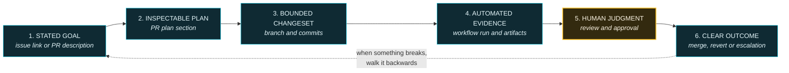

# D5 — Minimum Audit Trail

**Used in:** Part 3, section 6. Built link by link on click, then the whole chain is walked backwards
on screen against the real merged PR from the demo.

**Point it must make:** six links. Break any one and you cannot reconstruct what happened. This is not
a compliance checkbox — it is the thing you need at 2am.

## The four post-incident questions

Put these on the slide underneath the chain, revealed after the backwards arrow appears.

1. Was there a visible plan and scope?
2. Were the right reviewers requested — and did they approve?
3. Did the checks match the risk of the change?
4. Is the audit trail sufficient to reconstruct what happened?

## Narration anchor

> "Six links. And notice that link five is the only one a machine cannot produce for you. Everything
> else GitHub records automatically. The human judgement is the part that has to be deliberately
> added — which is exactly the part that gets skipped when the volume goes up."

## Build notes

- Link 5 is amber, every other link is cyan. That single colour break is the whole argument of the
  slide and needs no explanation.
- The dotted backwards arrow should animate last and slowly. The forward chain is how work happens;
  the backwards walk is how incidents get solved.
- When walking this against the real PR on camera, start at the merge commit and click backwards.
  Going forwards feels like a tour. Going backwards feels like an investigation, which is the point.
