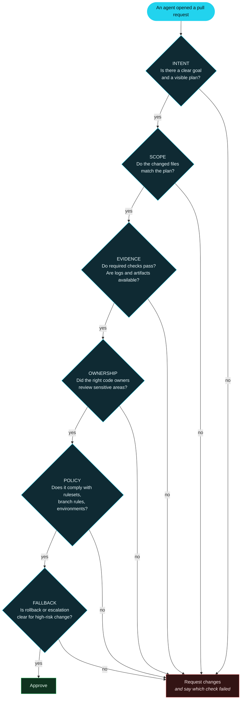

# D6 — The Six-Point Review Rubric

**Used in:** Part 3, section 8. This is the takeaway asset of the entire series — it must be legible
as a paused screenshot on a phone. Also drives the thumbnail concept for Part 3.

**Point it must make:** this is not a special standard for AI. It is the standard of a healthy
engineering workflow, applied consistently.

## What good looks like — the companion five

Show immediately after the rubric, as a plain list. These are the properties a PR has *after* it
passes all six checks.

- **Understandable** — clear goal and plan
- **Bounded** — scoped changeset, least privilege
- **Reviewable** — right owners involved, evidence present
- **Policy-compliant** — rulesets, branch rules, environments respected
- **Reconstructable** — audit trail supports post-hoc analysis

## The two failure modes this rubric prevents

| Failure mode | What it sounds like | Why the rubric stops it |
| --- | --- | --- |
| Excessive suspicion | "Reject it, an AI wrote it" | None of the six checks asks who the author was |
| Excessive trust | "Approve it, the build is green" | Evidence is one check out of six, not the whole review |

## Narration anchor

> "Six questions. Read them again and tell me which one you would not ask a human contributor.
> That is the whole point. This is not an AI review checklist. It is a review checklist — and the
> only thing that changed is how many pull requests are now arriving."

## Build notes

- Every "no" path collapses into one node. Do not draw six separate rejection boxes; the visual noise
  destroys the readability that makes this a shareable screenshot.
- For the phone-legibility test: render at 1920x1080, scale to 400px wide, and check the six headline
  words — INTENT, SCOPE, EVIDENCE, OWNERSHIP, POLICY, FALLBACK — are still readable. If not, drop the
  italic sub-questions from the graphic and keep them in narration only.
- The six headline words in order are the Part 3 thumbnail. Keep the wording locked across the
  diagram, the slide, the thumbnail and the YouTube description.
